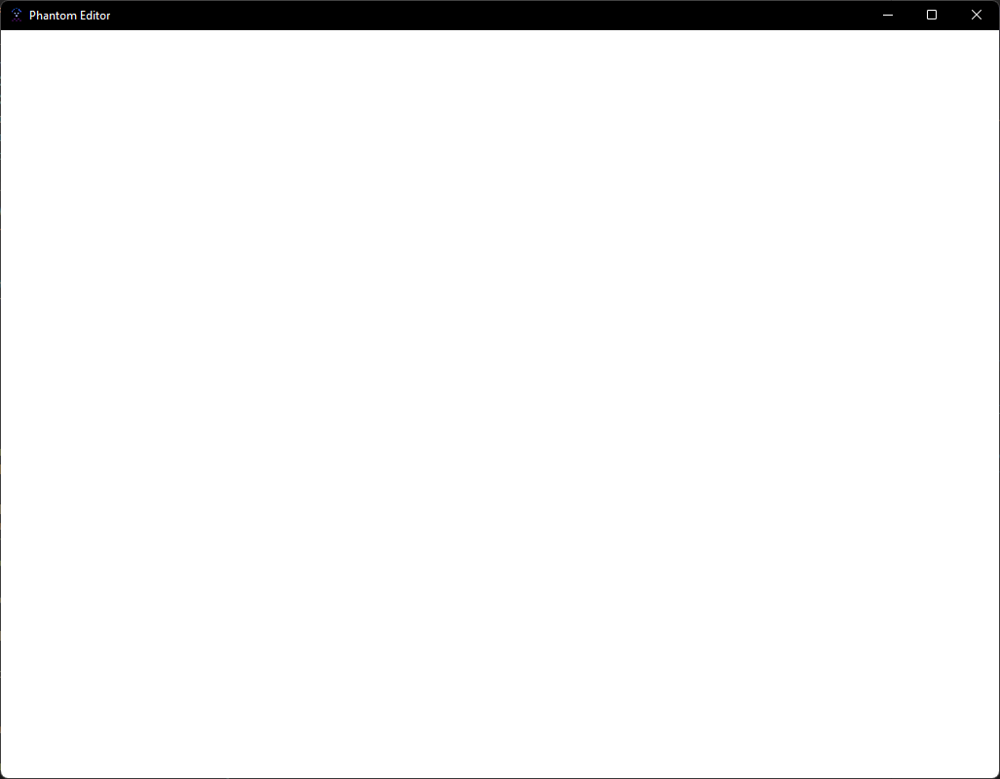

# Final Project Preview

## Chapter 1

* Set up the project structure
* Create the boilerplate code used throughout the rest of the book
* Get a window up and running

The code in this chapter will serve as the project's foundation.

## Chapter 2

TBD
