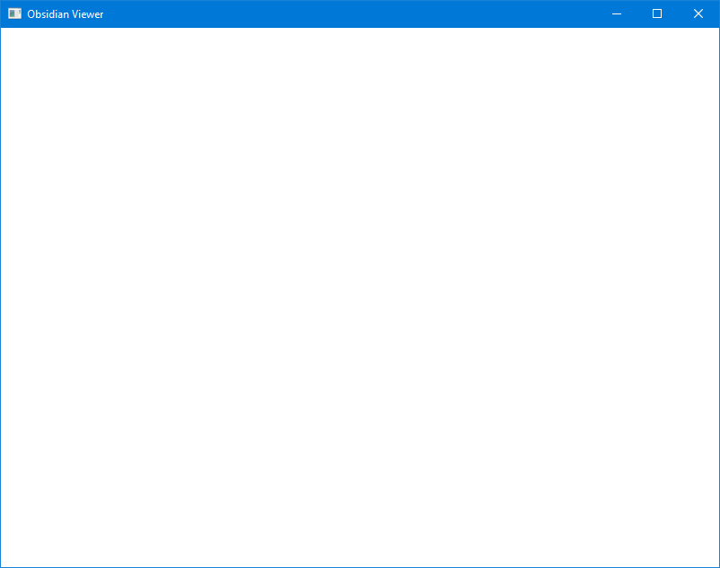

# Creating the Application

To make our application boilerplate reusable, we created the `obsidian_app` library. Now, we can start filling it out!

## Configuring the Application

Add an application configuration struct:

```rust,noplaypen
pub struct AppConfig {
    pub width: u32,
    pub height: u32,
    pub title: String,
}

impl Default for AppConfig {
    fn default() -> Self {
        Self {
            width: 800,
            height: 600,
            title: "Obsidian Application".to_string(),
        }
    }
}
```

## Dependencies

We will need to pull in crates for [windowing](https://github.com/rust-windowing/winit), [error handling](https://github.com/dtolnay/anyhow), and the [rust logger facade](https://github.com/rust-lang/log).

Add the following to `crates/obsidian_app/Cargo.toml`:

```toml
anyhow = "1.0.34"
log = "0.4.11"
winit = "0.24.0"
```

And add the following to `viewer/Cargo.toml`:

```toml
anyhow = "1.0.34"
log = "0.4.11"
```

## Generalizing the Application

The application can be broken down into discrete steps, such as initialization, updating, handling events, and more. This can be described with a trait:

```rust,noplaypen
pub trait Run {
    fn initialize(&mut self, _application: &mut Application) -> Result<()> {
        Ok(())
    }

    fn update(&mut self, _application: &mut Application) -> Result<()> {
        Ok(())
    }
}
```

Now we can create a function to execute any type that implements the trait:

```rust,noplaypen
pub fn run_application(mut runner: impl Run + 'static, configuration: AppConfig) -> Result<()> {
    // TODO ...
}
```

## The Event Loop

Now we can fill out the body of the `run_application` function.

We can create the window, an instance of the application, and call the `initialize` function of the runner.

```rust,noplaypen
    let (event_loop, _window) = create_window(&configuration)?;

    let mut application = Application {};

    log::info!("Running Application");
    runner.initialize(&mut application)?;
```

The `winit` crate manages the event loop. For easy error handling, we will use a lambda that returns a `Result<()>` to handle each cycle. This lets us check for application errors and log them.

Inside of the event loop we can also handle events and invoke the application runner's methods.

> Note: The [control_flow](https://docs.rs/winit/0.24.0/winit/event_loop/enum.ControlFlow.html) object allows controlling the main loop's behavior. For a game loop or realtime rendering application we will need to execute the loop continously, so we use `ControlFlow::Poll`.

```rust,noplaypen
    event_loop.run(move |event, _, control_flow| {
        let mut cycle_result = || -> Result<()> {
            *control_flow = ControlFlow::Poll;
            match event {
                Event::MainEventsCleared => {
                    runner.update(&mut application)?;
                }
                Event::WindowEvent {
                    event: WindowEvent::CloseRequested,
                    ..
                } => {
                    *control_flow = ControlFlow::Exit;
                }
                Event::LoopDestroyed => {
                    info!("Exited application");
                }
                _ => {}
            }
            Ok(())
        };
        if let Err(error) = cycle_result() {
            error!("Application Error: {}", error);
        }
    });

```

## Source Code

The full source for the `app` module code presented so far look like this:

```rust,noplaypen
// crates/obsidian_app/src/app.rs
use anyhow::Result;
use log::{error, info};
use winit::{
    dpi::PhysicalSize,
    event::{Event, WindowEvent},
    event_loop::{ControlFlow, EventLoop},
    window::{Window, WindowBuilder},
};

pub struct AppConfig {
    pub width: u32,
    pub height: u32,
    pub title: String,
    pub logfile_name: String,
}

pub fn create_window(config: &AppConfig) -> Result<(EventLoop<()>, Window)> {
    let event_loop = EventLoop::new();

    let window = WindowBuilder::new()
        .with_title(config.title.to_string())
        .with_inner_size(PhysicalSize::new(config.width, config.height))
        .build(&event_loop)?;

    Ok((event_loop, window))
}

impl Default for AppConfig {
    fn default() -> Self {
        Self {
            width: 800,
            height: 600,
            title: "Obsidian Application".to_string(),
            logfile_name: "obsidian.log".to_string(),
        }
    }
}

pub struct Application;

pub trait Run {
    fn initialize(&mut self, _application: &mut Application) -> Result<()> {
        Ok(())
    }

    fn update(&mut self, _application: &mut Application) -> Result<()> {
        Ok(())
    }
}

pub fn run_application(mut runner: impl Run + 'static, configuration: AppConfig) -> Result<()> {
    let (event_loop, _window) = create_window(&configuration)?;

    let mut application = Application {};

    log::info!("Running Application");
    runner.initialize(&mut application)?;

    event_loop.run(move |event, _, control_flow| {
        let mut cycle_result = || -> Result<()> {
            *control_flow = ControlFlow::Poll;
            match event {
                Event::MainEventsCleared => {
                    runner.update(&mut application)?;
                }
                Event::WindowEvent {
                    event: WindowEvent::CloseRequested,
                    ..
                } => {
                    *control_flow = ControlFlow::Exit;
                }
                Event::LoopDestroyed => {
                    info!("Exited application");
                }
                _ => {}
            }
            Ok(())
        };
        if let Err(error) = cycle_result() {
            error!("Application Error: {}", error);
        }
    });
}
```

## Creating the Viewer

Finally, we can use our boilerplate code to create the `Viewer`.

```rust,noplaypen
// obsidian/viewer/src/main.rs
use anyhow::Result;
use log::info;
use obsidian::app::{run_application, AppConfig, Application, Run};

pub struct Viewer;

impl Run for Viewer {
    fn initialize(&mut self, _application: &mut Application) -> Result<()> {
        info!("Viewer initialized");
        Ok(())
    }

    fn update(&mut self, _application: &mut Application) -> Result<()> {
        Ok(())
    }
}

fn main() -> Result<()> {
    let viewer = Viewer {};
    run_application(
        viewer,
        AppConfig {
            title: "Obsidian Viewer".to_string(),
            logfile_name: "viewer.log".to_string(),
            ..Default::default()
        },
    )
}
```

Now, when you run the application with `cargo run --release` from the project root the application will display an empty window with a custom title!

